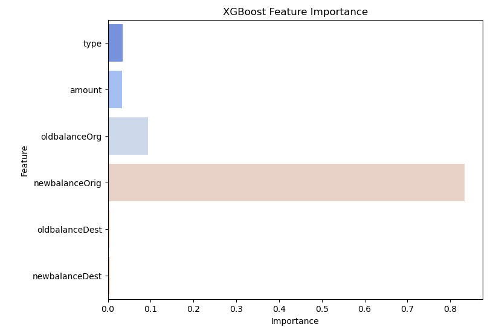
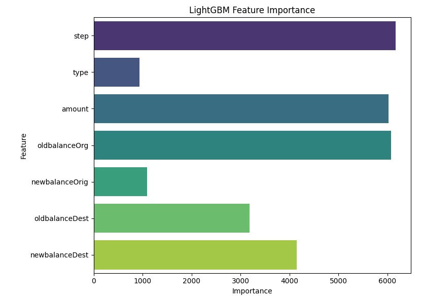

# 📌 Discussion

In the evolving landscape of digital banking, financial institutions face an escalating challenge: detecting fraudulent transactions in real time while minimising disruptions to legitimate customers. Fraud detection systems must balance competing priorities, catching as many fraudulent transactions as possible (recall) while maintaining a high true positive rate across all thresholds (AUC-ROC), without overwhelming fraud analysts with false alarms (Saito & Rehmsmeier, 2015). This report argues that recall should be the primary metric for evaluating fraud detection models, with AUC-ROC serving as a secondary but critical measure.

In a banking context, the cost of undetected fraud (false negatives) is significantly higher than the inconvenience of a false positive. A missed fraud transaction can lead to:
- Direct financial losses, which the bank may be liable to reimburse.
- Regulatory consequences, especially if the undetected fraud is part of a broader pattern.
- Customer dissatisfaction and loss of trust, which can result in account closures or negative publicity.

By contrast, a false positive, where a legitimate transaction is incorrectly flagged, often only results in a temporary inconvenience, such as a customer being asked to confirm the transaction. Most banks already have customer-friendly workflows to verify such cases quickly (e.g., SMS confirmation, app notifications, or calls from fraud departments). As a result, the operational cost of false positives is manageable when compared to the high cost of letting fraud go undetected.

At the same time, it is important to balance recall with an understanding of overall model performance across thresholds, which is where the AUC-ROC score comes in. AUC provides a holistic view of the model’s ability to separate cases, independent of a specific probability cutoff. A model with a high AUC value demonstrates a strong ability to distinguish between fraud and non-fraud, even if its threshold is later adjusted to favour recall. This makes AUC a valuable secondary metric for comparing models more objectively, especially when we anticipate needing to tune thresholds based on evolving fraud strategies.

Given these priorities, it is essential to evaluate fraud detection models not solely on overall accuracy, but on their ability to maximise recall while maintaining discriminatory power, captured by the AUC-ROC score. With this in mind, we begin our analysis with logistic regression—a widely used, interpretable, and computationally efficient model that serves as a baseline for more complex algorithms. While it may not achieve the highest recall among the models tested, logistic regression provides valuable insights into the trade-offs between simplicity, transparency, and performance, making it a practical starting point for real-world fraud detection systems in banking. The following section will analyse logistic regression’s strengths and limitations, examining its precision-recall trade-offs, practical deployment considerations, and role in a tiered fraud detection framework. Understanding its performance helps us see where challenger models improve and where logistic regression remains indispensable.

---

## 4.1 Baseline Model

### 4.1.1 Logistic Regression

Logistic regression is a fundamental statistical model for binary classification problems (Sahin & Duman, 2011). It is especially appealing in a banking context for three key reasons:
- **Interpretability**: Logistic regression provides clear, explainable coefficients for each feature, making it easy to understand and communicate why a transaction was classified as fraudulent (Dhankhad et al., 2018). This is especially important in the banking and finance industries, where models are often subject to scrutiny by internal compliance teams, regulators, and external auditors. For example, if a particular transaction is flagged as fraud, we can explicitly show how factors like unusually high transaction amounts contributed to that decision.
- **Low computational cost**: Logistic regression is fast to train and deploy, even on large datasets. This allows for rapid iteration and real-time implementation in production systems with minimal infrastructure requirements, critical for institutions processing thousands of transactions per second (Hmidy and Mabrouk, 2024).
- **Baseline benchmarking**: Logistic regression serves as a strong baseline against which we can evaluate the performance gains of more complex models (Dhankhad et al., 2018). If an advanced model only marginally improves on logistic regression, we may question whether the added complexity is justified.

Our logistic regression model achieved 99% accuracy, which might initially suggest excellent performance. However, this metric is misleading in the context of fraud detection. Our dataset is highly imbalanced, with non-fraudulent transactions comprising the overwhelming majority. As a result, a model that simply predicts “non-fraud” for every transaction would achieve high accuracy while completely failing to detect fraud.

This is why we prioritise recall. The ability to detect as many actual fraudulent cases as possible. Our logistic regression model achieved 86% precision but only 42% recall. This means that while it is conservative in its predictions (most of the frauds it detects are indeed fraud), it fails to identify more than half of the actual fraudulent transactions.

#### Where Logistic Regression Still Adds Value

Despite its limited recall, logistic regression retains a practical role in real-world banking operations, particularly when used strategically:
- **Low-risk transaction monitoring** For example, low-value purchases, internal fund transfers between known accounts, or transactions within highly trusted customer segments may not justify the computational cost of advanced fraud models. It can be reliably used to monitor these low-risk transactions, allowing institutions to preserve resources for higher-risk cases.
- **Tiered detection systems**: Logistic regression can be deployed as the first stage in a multi-layer fraud detection pipeline, where it quickly eliminates legitimate transactions. More computationally intensive models can then be reserved for suspicious or ambiguous cases.
- **Resource-constrained settings**: In institutions with limited technical resources, logistic regression’s ease of implementation enables these players to implement a basic fraud detection system quickly, providing immediate protection while more advanced systems are built over time.

By aligning logistic regression with specific business contexts, banks can tap on its strengths while complementing it with more sophisticated models (section 4.2) for high-risk detection scenarios. 

---

## 4.2 Challenger Models

We chose to implement boosting models as challenger models in our fraud detection task due to their strong performance on structured data and ability to handle common challenges in fraud analytics (Singh and Jain, 2022). One of the key considerations was the need to model complex, non-linear relationships between features.

Our dataset contains a mix of numerical and categorical variables. Through exploratory analysis, we hypothesised that categorical features such as transaction type could be vital in identifying fraudulent transactions. Boosting models like LightGBM and XGBoost are well-suited for such mixed data types, with LightGBM offering native support for categorical features.

Another major factor in our model selection was the extreme class imbalance. Fraudulent transactions made up only about 1.2% of the total dataset. Gradient boosting frameworks address this by allowing the adjustment of class weights, ensuring that the minority class receives sufficient attention during training.

After testing several models, we found that boosting algorithms consistently delivered high recall (proportion of actual fraudulent transactions that the model successfully detects) - the key metric we decided to use for model evaluation, and also high precision (proportion of transactions identified as fraud that are truly fraudulent). 
These optimisations deliver tangible business value by addressing both sides of the fraud detection cost equation.

### 4.2.1 XGBoost
In addressing the challenges of fraud detection in banking, we selected XGBoost as a key challenger model due to its proven effectiveness with structured data and capability to handle complex interactions between variables.

First, XGBoost is incredibly capable of handling complex, non-linear relationships.
XGBoost builds sequential decision trees, where each tree corrects errors from the previous ones. This iterative approach allows the model to effectively capture intricate, non-linear patterns within transactional data, essential for detecting sophisticated fraud schemes.

Another key reason for selecting XGBoost is due to its ability to tackle class Imbalance. Our chosen datasets (and most fraud datasets in general) exhibit severe imbalance, with fraudulent transactions often representing only a small fraction of the data. XGBoost directly addresses this by enabling the adjustment of class weights, placing greater emphasis on accurately identifying the minority (fraudulent) class. This improves recall significantly, which is a critical metric in fraud detection, by ensuring fewer genuine fraud cases go unnoticed.

The chart above shows the feature importance scores generated by our XGBoost model. Feature importance in this context refers to how useful each feature was in constructing the model’s decision trees. A higher value indicates that the feature contributed more to the model's ability to correctly classify transactions as fraudulent or not.

From the chart, it is evident that newbalanceOrig was by far the most influential feature in fraud detection. This suggests that the remaining balance of the sender after a transaction carries significant predictive power, potentially indicating cases where fraud leads to a sudden drop to zero or near-zero balance.

Other features like oldbalanceOrg, amount, and type also had some predictive value, though to a much lesser extent. In contrast, destination account balances — oldbalanceDest and newbalanceDest — had near-zero importance, implying that the model found them irrelevant for distinguishing fraudulent activity.

This insight aligns with our earlier EDA, where we observed that fraud cases often involved specific patterns in the sender's balance before and after a transaction. These findings helped us confirm that focusing on origin account behaviour is crucial for improving fraud detection performance.

To evaluate XGBoost’s performance, we compared its effectiveness using three oversampling techniques: SMOTETomek, SMOTE, and ADASYN. Each method was tested with the same set of hyperparameters for consistency. All three techniques achieved excellent ROC-AUC scores near 0.998, confirming XGBoost's strong capability in distinguishing between legitimate and fraudulent transactions.

However, deeper analysis revealed meaningful differences between the oversamplers. When recall was prioritised—critical for fraud detection—we observed that:
- **SMOTETomek** achieved a recall of **0.963** and a precision of **0.545**, yielding an F1 score of **0.696** at a threshold of **0.96**.
- **SMOTE** had a slightly higher recall of **0.970**, but a lower precision of **0.533**, resulting in an F1 score of **0.688**.
- **ADASYN** achieved the highest recall at 0.986, but at the cost of precision (0.459) and a lower F1 score of 0.627.
SMOTETomek achieved a recall of **0.963** and a precision of **0.545**, yielding an F1 score of **0.696** at a threshold of **0.96**.

These results indicate that while ADASYN may maximize recall, it does so at the expense of precision, potentially increasing the number of false alarms. From a business standpoint, this could overwhelm fraud investigation teams and degrade customer experience due to unnecessary alerts. SMOTETomek, in contrast, provides the best trade-off between recall and precision, making it the most balanced and practical choice.

We further tuned the decision threshold using precision-recall analysis. At the optimal threshold of 0.995, the model achieved **a precision of 0.952**, **recall of 0.757**, and an **F1 score of 0.844**. This demonstrates that with appropriate threshold calibration, XGBoost can be tuned to achieve high overall performance metrics.

Additionally, accuracy across all evaluated models was exceptionally high (above 99.9%), further underscoring XGBoost's reliability. However, accuracy alone is insufficient due to class imbalance, hence our focus on F1 and recall.

Overall, XGBoost not only delivers superior predictive performance but also aligns with the practical needs of fraud prevention systems in high-volume financial environments. Its flexibility, reliability, and compatibility with oversampling techniques make it a strong candidate for production-level fraud detection systems.

---

### 4.2.2 LightGBM

LightGBM is well-suited for our banking transaction fraud detection scenario due to its exceptional speed and scalability. Unlike traditional gradient boosting methods, LightGBM uses a histogram-based algorithm (Neptune.ai, 2024) and parallel processing to train models significantly faster while consuming less memory than XGBoost. This speed advantage becomes especially important in the context of banking, where transaction data is both massive and continuously growing.

The speed advantage is more than just a technical benefit. It is strategically important for fraud detection. Since fraud techniques constantly evolve, banks need to regularly retrain their models with new data to stay effective. LightGBM’s short training time makes frequent retraining feasible, ensuring the model remains up-to-date and responsive to emerging fraud patterns.

Another advantage is LightGBM’s native handling of categorical features. It can directly process integer-encoded categorical variables and automatically determine the optimal splits (Xu, 2024). Whereas XGBoost typically requires manual feature transformation, which adds to preprocessing time and memory consumption. LightGBM’s ability to efficiently handle mixed data types reduces the complexity of data preparation and preserves feature structure.

From our model evaluation, LightGBM emerged as a strong candidate for fraud detection in the banking context. It achieved a precision of 82%, recall of 78%, and an F1-Score of 80%, with an AUC-ROC of 94.46%.

A precision of 82% means that the vast majority of transactions predicted as fraudulent are indeed fraud cases. A recall of 78% indicates that the model successfully detects a large proportion of all fraudulent transactions occurring within the dataset. The F1-Score combines both precision and recall into a single measure, balancing the trade-off between catching fraud and avoiding false alarms. An F1-Score of 80% suggests LightGBM achieves a well-balanced performance in this regard. With a high AUC of 94.46%, LightGBM demonstrates strong overall discriminatory power, giving banks flexibility to adjust thresholds based on their risk tolerance or operational priorities.

While XGBoost outperformed LightGBM slightly in specific cases when manually tuned to optimise certain metrics, LightGBM stands out for its faster training and retraining speed. This makes it especially suited for production environments where fraud patterns evolve rapidly and models need to be updated frequently. Its ability to deliver strong, consistent results with less computational overhead translates into real operational value, enabling faster deployment, lower infrastructure costs, and better responsiveness to emerging fraud trends.
Overall, LightGBM provides a compelling balance between accuracy, efficiency, and practical usability, making it a highly viable model for banks seeking to enhance fraud detection without compromising customer experience or scalability.

Despite these advantages, LightGBM also has certain limitations we must consider for practical implementation.

Firstly, LightGBM models can be challenging to interpret and clearly explain, particularly for non-technical stakeholders. In banking, transparency and explainability are often mandated by regulatory authorities to ensure accountability. Although methods such as SHAP (SHapley Additive exPlanations), a technique that quantifies how each feature contributes to individual predictions, can partially mitigate this issue by providing insights into model decisions. (Turdalyuly et al.,2025) Some regulatory bodies remain cautious or prohibit using inherently "black-box" approaches. Thus, for banks operating under stringent regulatory environments, LightGBM’s limited interpretability can restrict its practical usability.

Secondly, LightGBM is susceptible to overfitting compared to other algorithms. Because it builds decision trees leaf-wise (Neptune.ai, 2024) by expanding the most promising branches first. The model can become overly specialised, particularly when dealing with data containing irrelevant patterns, random errors, or inconsistencies that do not represent genuine relationships. Without careful regularisation through hyperparameters such as maximum tree depth or early stopping, LightGBM may capture random anomalies only in the training data, negatively impacting its performance on unseen data. Hence, diligent hyperparameter tuning is necessary to ensure robust performance and generalisability.

The chart above displays the feature importance from our LightGBM model, which uses frequency-based importance. In other words, how often a feature was used in decision tree splits. Unlike XGBoost, LightGBM leveraged a wider range of features in a more balanced way.

Interestingly, step emerged as the most frequently used feature in the model, suggesting that the time of transaction (measured in hourly steps) carries hidden patterns that help in distinguishing between fraudulent and legitimate transactions. This was not initially expected from our EDA, but the model found it useful.

Following closely are amount, oldbalanceOrg, and newbalanceDest, all of which were used heavily in decision-making. This aligns with the intuition that fraudsters often manipulate transaction amounts or drain accounts in unusual ways.

In contrast to XGBoost, which heavily relied on newbalanceOrig, LightGBM distributed importance more evenly across both origin and destination balance features. This suggests that LightGBM may be capturing more complex interactions across multiple features, rather than depending heavily on a single variable.

These findings support the strength of LightGBM in handling multi-feature dependencies and reinforce its value in fraud detection tasks.

---

## 4.3 Model Comparison and Strategic Development

The fraud detection landscape in banking requires a strategic blend of models that balance interpretability, efficiency, and predictive power. Each model, logistic regression, XGBoost, and LightGBM, brings distinct advantages and limitations that influence how they should be applied in real-world scenarios.

1. Logistic regression is fast, interpretable, and easy to deploy, making it well-suited for low-risk transaction monitoring or as a pre-screening layer in a multi-tiered system. Its transparency is valuable for compliance and regulatory reporting. However, it struggles to detect complex fraud patterns and suffers from lower recall, limiting its effectiveness when used alone.
2. XGBoost provides strong performance on imbalanced datasets and captures non-linear relationships between features, which is ideal for identifying sophisticated fraud. Its ability to tune class weights enhances recall, helping reduce missed fraud cases. While more resource-intensive than logistic regression, XGBoost is reliable for analyzing high-risk or ambiguous transactions where accuracy is critical.
3. LightGBM builds on the strengths of XGBoost, offering faster training times and better scalability for large datasets. Its efficient handling of categorical data and reduced memory usage make it suitable for real-time systems and frequent model updates. However, it requires careful tuning to avoid overfitting and is less interpretable by default.

For optimal deployment, banks should adopt a tiered fraud detection framework that leverages each model’s strengths at different stages of the transaction evaluation pipeline (Talukder et al., 2024). Logistic regression can serve as a fast pre-screening model to eliminate clearly non-fraudulent transactions with minimal computational cost. Transactions that appear ambiguous or carry higher risk can be escalated to more complex models such as XGBoost or LightGBM for deeper analysis. XGBoost may be favored in critical contexts where reliability and recall are paramount, while LightGBM is ideal for situations requiring speed, frequent retraining, or deployment at scale. 

By strategically combining these models, banks can build robust, layered fraud detection systems that adapt to changing fraud patterns, maintain regulatory compliance, and protect both financial assets and customer experience. This hybrid approach ensures that no single model becomes a bottleneck and that the system as a whole is greater than the sum of its parts.